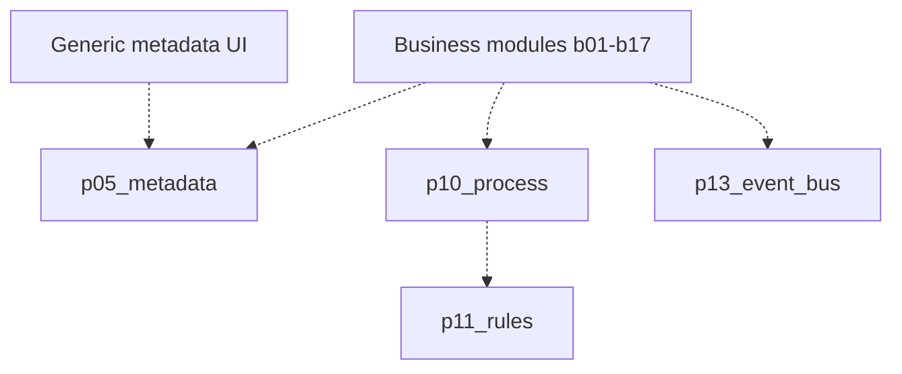

# Architecture

**Product:** JeslotERP  
**Document type:** Public architecture  
**Evidence date:** 2026-09-20  

This document describes the **actual** architecture of the current platform
kernel, then a **recommended conceptual model** for readers who want a simpler
layering story.


| Status | Meaning |
|---|---|
| `IMPLEMENTED` | Shipped kernel: HTTP, persistence, permissions, and tests exist for the documented slice. |
| `PARTIALLY_IMPLEMENTED` | Kernel exists, but important engines, providers, or integrations remain incomplete or fail-closed. |
| `FOUNDATION_AVAILABLE` | Supporting contracts, schemas, or hooks exist; the capability is not a complete product. |
| `PLANNED` | Specified in the architecture / business registry; no implementation package found. |
| `TODO` | Explicit work item required before the capability can be called implemented. |
| `FUTURE` | Intended evolution; not current scope. |
| `NOT_FOUND` | No implementation evidence in the current project. |
| `NOT_VERIFIED` | Mentioned in architecture but not independently confirmed as working end-to-end. |


## 1. What JeslotERP is

JeslotERP is a **modular Python platform** for multi-tenant enterprise
applications. The current implementation is a single deployable application
that loads numbered platform packages through a module plugin registry.

Each package typically follows a hexagonal / clean layout:

```text
domain        — concepts, policies, exceptions
application   — services, commands/queries, ports, permission catalogs
infrastructure— HTTP, persistence, optional providers, outbox, workers
```

Packages do not import one another's ORM models. They integrate through
HTTP, ports / gateways, permission names, and outbox events.

## 2. Actual structure (verified)

```text
Apps / API host
  mounts each ModulePlugin
  public HTTP    /api/v1/*
  internal HTTP  /internal/v1/*
  health         module list in dependency order

platforms/
  p01_identity … p33_sharing

business/
  package namespace reserved for bNN_*
  (only the namespace exists — no business modules implemented)

persistence
  PostgreSQL schemas named by domain (identity, org, bp, metadata, …)
  never p01 / p23 in schema names
  row-level security on tenant paths
  Alembic migrations for the kernel
```

A consuming desktop / web client exists and already hosts platform operator
consoles plus a metadata-driven partner/company pilot. That client is a
consumer of `/api/v1`. It is not a second system of record.

Legacy portal mounts are not the supported write path. The supported SoR is
the platform HTTP surface.

## 3. Recommended conceptual layers

The implementation is a modular monolith, not five separately deployed
products. The following layers are a **reading model**. They match package
intent; they are not separate processes.

```text
Application Layer          Desk / operator consoles / future generic entity UI
        ↓
Business Platform          b01–b17  (PLANNED)
        ↓
Platform Services          metadata, localization, numbers, media, document,
                           process, rules, feature, reporting, dashboard,
                           licensing, AI, extensibility, ALM, privacy, output
        ↓
Platform Foundation        identity, organization, configuration,
                           business partner, security, sharing
        ↓
Infrastructure             event bus, messaging, notification, cache,
                           scheduler, search, audit, logging, monitoring,
                           API product, integration
```

### Layer map (all 33 packages)

| Layer | Packages |
|---|---|
| Platform Foundation | `p01_identity`, `p02_organization`, `p03_configuration`, `p04_business_partner`, `p28_security`, `p33_sharing` |
| Platform Services | `p05_metadata`, `p06_localization`, `p07_number_series`, `p08_file_media`, `p09_document`, `p10_process`, `p11_rules`, `p12_feature`, `p24_reporting`, `p25_dashboard`, `p26_licensing`, `p27_ai`, `p29_extensibility`, `p30_alm`, `p31_privacy`, `p32_output` |
| Infrastructure | `p13_event_bus`, `p14_messaging`, `p15_notification`, `p16_cache`, `p17_scheduler`, `p18_search`, `p19_audit`, `p20_logging`, `p21_monitoring`, `p22_api`, `p23_integration` |
| Business Platform | `b01`–`b17` — **PLANNED** |
| Application | API host + consuming UI (not numbered as pNN) |

## 4. Cross-cutting rules (verified intent + code practice)

1. **One concern, one owner.** Identity is not organization. Configuration is not metadata. Event bus is not notification.
2. **No cross-schema foreign keys.** UUID references and gateways only.
3. **Permission codes are namespaced** (`identity.*`, `bp.*`, `metadata.*`, …).
4. **Outbox, not dual writes.** Packages persist an outbox row with the business transaction.
5. **Optional providers fail closed.** Missing mail, object storage, search cluster, payments, or KMS does not invent success.
6. **Safe expressions only.** Metadata and rules use allow-listed ASTs. Extensibility forbids `eval` of stored code.
7. **SoR-Live is not Production.** The kernel HTTP slice persists; soak, threat review, and live vendors remain open.

## 5. Actual dependency graph (declared module plugins)

```mermaid
graph TD
    p01[p01_identity]
    p02[p02_organization]
    p03[p03_configuration]
    p04[p04_business_partner]
    p05[p05_metadata]
    p06[p06_localization]
    p07[p07_number_series]
    p08[p08_file_media]
    p09[p09_document]
    p10[p10_process]
    p11[p11_rules]
    p12[p12_feature]
    p13[p13_event_bus]
    p14[p14_messaging]
    p15[p15_notification]
    p16[p16_cache]
    p17[p17_scheduler]
    p18[p18_search]
    p19[p19_audit]
    p20[p20_logging]
    p21[p21_monitoring]
    p22[p22_api]
    p23[p23_integration]
    p24[p24_reporting]
    p25[p25_dashboard]
    p26[p26_licensing]
    p27[p27_ai]
    p28[p28_security]
    p29[p29_extensibility]
    p30[p30_alm]
    p31[p31_privacy]
    p32[p32_output]
    p33[p33_sharing]

    p02 --> p01
    p03 --> p01
    p03 --> p02
    p04 --> p01
    p04 --> p02
    p04 --> p03
    p05 --> p01
    p05 --> p02
    p05 --> p03
    p06 --> p01
    p06 --> p03
    p07 --> p01
    p07 --> p02
    p07 --> p03
    p08 --> p01
    p08 --> p02
    p09 --> p01
    p09 --> p07
    p09 --> p08
    p10 --> p01
    p10 --> p02
    p10 --> p03
    p10 --> p04
    p10 --> p09
    p11 --> p01
    p11 --> p02
    p11 --> p03
    p11 --> p05
    p12 --> p01
    p12 --> p02
    p12 --> p03
    p13 --> p01
    p14 --> p13
    p14 --> p01
    p15 --> p01
    p15 --> p06
    p15 --> p14
    p16 --> p01
    p16 --> p03
    p17 --> p01
    p17 --> p14
    p18 --> p05
    p18 --> p08
    p18 --> p09
    p19 --> p01
    p19 --> p02
    p19 --> p13
    p20 --> p01
    p21 --> p20
    p22 --> p01
    p22 --> p12
    p22 --> p16
    p23 --> p13
    p23 --> p14
    p23 --> p22
    p24 --> p02
    p24 --> p05
    p24 --> p18
    p25 --> p03
    p25 --> p12
    p25 --> p16
    p25 --> p24
    p26 --> p01
    p26 --> p02
    p26 --> p03
    p26 --> p04
    p26 --> p12
    p26 --> p13
    p26 --> p14
    p26 --> p16
    p26 --> p17
    p26 --> p19
    p26 --> p21
    p27 --> p08
    p27 --> p18
    p27 --> p22
    p28 --> p01
    p28 --> p03
    p29 --> p01
    p30 --> p01
    p31 --> p01
    p31 --> p19
    p32 --> p01
    p32 --> p06
    p33 --> p01
    p33 --> p02
```



This graph is **declared plugin dependencies only**. Additional runtime
couplings (sharing evaluate, number allocation, KMS wrap, hook invoke) are
documented per package and in [DEPENDENCY_ARCHITECTURE.md](DEPENDENCY_ARCHITECTURE.md).

No circular declared dependency was found among the thirty-three module plugins.

## 6. Proposed architecture (not claimed as implemented)



Dashed edges are the intended ERP spine after the first business module exists.

## 7. Data and API conventions

- JSON HTTP with a standard success / error envelope.
- Public versus internal route prefixes.
- Idempotency keys on mutating platform APIs where the kernel requires them.
- Optimistic concurrency (`If-Match` / version) on selected configuration and catalog writes.

Exact private URLs, hosts, and credentials are intentionally omitted.

## 8. What is implemented versus planned

| Capability | Status |
|---|---|
| 33 platform packages + HTTP + schema + tests | IMPLEMENTED (kernel slice) |
| Metadata dictionary, layouts, validate, publish | IMPLEMENTED |
| Partner and company metadata pilots | IMPLEMENTED |
| Business ledgers and transactional ERP documents | PLANNED |
| Production soak / threat / live vendors | FUTURE / BLOCKED on environment |
| Open-source source release | FUTURE |
