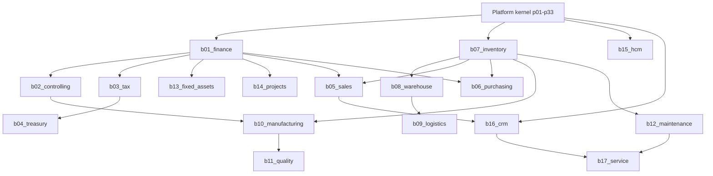

# Business Module Dependencies

## Actual (today)

```text
p01_identity
   ↓
p02_organization
   ↓
p03_configuration
   ↓
p04_business_partner     ← only business-adjacent master that exists
   ↓
(no business ledgers)
```

Platform services already available for the first module: `p05_metadata`,
`p07_number_series`, `p08_file_media`, `p09_document`, `p10_process`,
`p11_rules`, `p13_event_bus`, `p19_audit`, `p32_output`, `p33_sharing`.

## Future (registry build order)



All edges above except those into the kernel are **future dependencies**.

## Recommended first spine

```text
Identity → Organization → Business Partner → Items (b07)
    → Inventory ledger (b07) → Sales / Purchase (b05 / b06)
    → Accounting (b01) → Tax (b03) → Reporting (p24 content)
```

Alternative finance-first spine:

```text
Identity → Organization → COA / Period / Journal (b01)
    → Business Partner subledgers → Inventory / Sales later
```

## Rules

- Never reverse-depend: platforms must not import `business.bNN_*`.
- Shared documents (invoice that is both AR and tax) coordinate via events
  and posting APIs, not cross-schema foreign keys.
