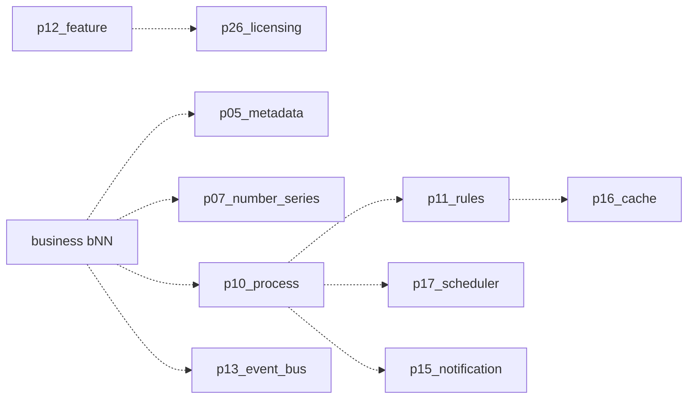

# Dependency Architecture

## Rules of evidence

- **Actual Dependency** = declared `ModulePlugin.dependencies` or a verified runtime call (allocate number, evaluate share, invoke hook, enqueue job).
- **Recommended Future Dependency** = documented integration that is not claimed as complete wiring.

Never mix the two in one list without a label.

## Foundational packages

`p01_identity` declares no plugin dependencies. Other packages depend on it
for authentication and the permission vocabulary.

`p02_organization` depends on `p01_identity`.

`p03_configuration` depends on `p01_identity` and `p02_organization`.

## Declared plugin graph

See the mermaid diagram in [ARCHITECTURE.md](ARCHITECTURE.md). Summary of
**actual declared** edges:

| Package | Declared depends on |
|---|---|
| `p01_identity` | — |
| `p02_organization` | `p01_identity` |
| `p03_configuration` | `p01_identity`, `p02_organization` |
| `p04_business_partner` | `p01_identity`, `p02_organization`, `p03_configuration` |
| `p05_metadata` | `p01_identity`, `p02_organization`, `p03_configuration` |
| `p06_localization` | `p01_identity`, `p03_configuration` |
| `p07_number_series` | `p01_identity`, `p02_organization`, `p03_configuration` |
| `p08_file_media` | `p01_identity`, `p02_organization` |
| `p09_document` | `p01_identity`, `p07_number_series`, `p08_file_media` |
| `p10_process` | `p01_identity`, `p02_organization`, `p03_configuration`, `p04_business_partner`, `p09_document` |
| `p11_rules` | `p01_identity`, `p02_organization`, `p03_configuration`, `p05_metadata` |
| `p12_feature` | `p01_identity`, `p02_organization`, `p03_configuration` |
| `p13_event_bus` | `p01_identity` |
| `p14_messaging` | `p13_event_bus`, `p01_identity` |
| `p15_notification` | `p01_identity`, `p06_localization`, `p14_messaging` |
| `p16_cache` | `p01_identity`, `p03_configuration` |
| `p17_scheduler` | `p01_identity`, `p14_messaging` |
| `p18_search` | `p05_metadata`, `p08_file_media`, `p09_document` |
| `p19_audit` | `p01_identity`, `p02_organization`, `p13_event_bus` |
| `p20_logging` | `p01_identity` |
| `p21_monitoring` | `p20_logging` |
| `p22_api` | `p01_identity`, `p12_feature`, `p16_cache` |
| `p23_integration` | `p13_event_bus`, `p14_messaging`, `p22_api` |
| `p24_reporting` | `p02_organization`, `p05_metadata`, `p18_search` |
| `p25_dashboard` | `p03_configuration`, `p12_feature`, `p16_cache`, `p24_reporting` |
| `p26_licensing` | `p01_identity`, `p02_organization`, `p03_configuration`, `p04_business_partner`, `p12_feature`, `p13_event_bus`, `p14_messaging`, `p16_cache`, `p17_scheduler`, `p19_audit`, `p21_monitoring` |
| `p27_ai` | `p08_file_media`, `p18_search`, `p22_api` |
| `p28_security` | `p01_identity`, `p03_configuration` |
| `p29_extensibility` | `p01_identity` |
| `p30_alm` | `p01_identity` |
| `p31_privacy` | `p01_identity`, `p19_audit` |
| `p32_output` | `p01_identity`, `p06_localization` |
| `p33_sharing` | `p01_identity`, `p02_organization` |

## Additional verified runtime couplings (actual, not declared)

| From | Uses | How |
|---|---|---|
| `p03_configuration` | `p28_security` | Key wrap / KMS port |
| `p04_business_partner` | `p07_number_series` | Partner code allocate |
| `p04_business_partner` | `p33_sharing` | Record visibility / owner grant |
| `p04_business_partner` | `p29_extensibility` | Lifecycle hooks |
| `p05_metadata` | `p29_extensibility` | Publish / package hooks |
| `p08_file_media` | `p33_sharing` | Object list filtering |
| `p09_document` | `p33_sharing` | Visibility |
| `p10_process` | `p33_sharing` | Instance visibility |
| `p10_process` | `p29_extensibility` | Lifecycle hooks |
| `p14_messaging` | `p15_notification`, `p23_integration`, `p26_licensing` | Handler keys |
| `p15_notification` | `p14_messaging` | Dispatch enqueue |
| `p17_scheduler` | `p14_messaging` | Due-work enqueue |
| `p22_api` | `p16_cache` | Gateway snapshot SDK |
| `p25_dashboard` | `p16_cache` | Widget cache namespace |
| `p26_licensing` | event / job / cache / schedule / audit / metrics bridges | Startup wiring |
| `p27_ai` | `p08_file_media`, `p18_search` | Corpus and index |
| `p30_alm` | `p28_security` | Sign / seal |
| `p31_privacy` | `p01_identity`, `p04_business_partner`, `p08_file_media` | Erase adapters |
| `p32_output` | `p08_file_media`, `p15_notification` | Artifact store and handoff |

These extra edges do **not** create a declared plugin cycle. Treat them as
optional or directional runtime uses.

## Recommended future dependencies (not claimed)

Notable recommended items still open:

- Process XOR gateways evaluating `p11_rules` end-to-end.
- Process timers fully owned by `p17_scheduler`.
- Feature-flag compile bound to licensing SKUs (product decision pending).
- Sharing evaluate on every remaining domain list.
- Business modules consuming the spine.

## Indirect dependencies

Example: `p25_dashboard` → `p24_reporting` → `p18_search` → `p09_document` →
`p08_file_media` → `p01_identity`.

Operators should assume that turning off a foundation package disables
everything above it.

## Optional / provider dependencies

These are adapters, not package numbers:

| Capability | Optional backend | Status |
|---|---|---|
| Object storage / antivirus | Cloud bucket + scanner | PROVIDER pending |
| Job broker | Redis / Rabbit | PROVIDER pending |
| Cache L2 | Redis | PROVIDER pending |
| Search engine | OpenSearch-class cluster | PROVIDER pending |
| Mail / SMS / WhatsApp | Provider credentials | PROVIDER pending |
| Payments | PSP | PROVIDER pending |
| KMS | Cloud KMS / HSM | PROVIDER pending |
| Models | External model API | PROVIDER pending |
| TSDB / SIEM | Metrics / SIEM HTTP | PROVIDER pending |
| PDF engine | Native PDF dependencies | PROVIDER pending |

## Extension points

Allow-listed hooks (`p29_extensibility`), metadata overlays, language packs,
feature packs, integration connector ports, renderer ports, and ALM artifacts.

## Circular dependencies

No circular **declared** plugin dependency was found.

Identity talks to organization through a gateway rather than a plugin
dependency, which avoids a p01 ↔ p02 cycle.

If a future design introduces p12 ↔ p26 compile, it must remain a one-way
bridge or an explicit shared contract — not mutual ORM imports.
