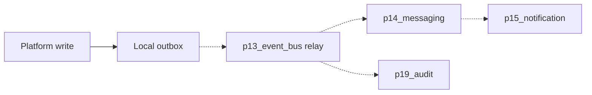

# Event Architecture

## Split (actual)

| Plane | Package | Question |
|---|---|---|
| Domain facts | `p13_event_bus` | What happened, with a schema? |
| Jobs | `p14_messaging` | Who processes it, with retries? |
| Human / channel delivery | `p15_notification` | Who should be told? |
| Immutable trail | `p19_audit` | What must be retained for investigation? |

## Current capability

- Most packages write a **local outbox** in the same transaction as the write.
- `p13_event_bus` provides type / schema catalog, topics, subscriptions, publish, DLQ, and replay APIs.
- HTTP publish persists events and outbox when a database session is present.
- Messaging job handlers exist for notification dispatch, integration delivery, and licensing jobs.
- End-to-end “every outbox row is relayed by a production broker” is **NOT_VERIFIED**.

## Actual versus proposed

Solid: verified local persist. Dashed: intended fabric.

## Public event naming

Events are dotted names such as `bp.partner.created` or `process.task.completed`.
This document lists representative names per package. It is not a private
payload encyclopedia.

## Rules for future business modules

1. Persist the business row and the outbox fact together.
2. Do not call another module's ORM.
3. Consumers are idempotent.
4. PII in event payloads follows privacy classification.
