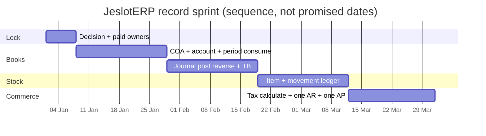

# Ninety-Day Plan — Record Sprint

**Owner:** Chetan Patel  
**Purpose:** Turn finished architecture into the first **posting product**
in the shortest honest window. This is a plan, not a claim that the work
is already done.

Staffing and funding change the calendar. They do **not** change the order.

The chart is a **shape**. Day 1 is the day owners are paid and finance is
locked — not a historical date.

## Days 1–7 — Lock

| Done means | Not done |
|---|---|
| Written lock: first module = `b01_finance` | “We will see” |
| One paid platform owner + one paid finance owner | Volunteer committee |
| Kernel branch rules: no p34+, no kernel rewrite | Redesign workshops |
| Acceptance tests copied from [REQUIREMENTS/B01_FINANCE.md](BUSINESS_PLATFORM/REQUIREMENTS/B01_FINANCE.md) | New invented scope |

## Days 8–28 — Chart and period

- COA version + company assignment
- GL account master on `p05_metadata` + `p07_number_series` if numbered
- Posting date vs `p02_organization` fiscal period
- Blocked account and missing-COA fail closed

**Exit:** an accountant can create an account and the system refuses a closed
period. No journal yet is acceptable; a journal without period lock is not.

## Days 29–49 — The book exists

- Balanced journal (txn + company currency)
- Post is immutable; reverse is a new document
- Idempotent inbound posting port (even if only a test adapter calls it)
- Trial balance dataset on `p24_reporting` (or a honest first query that
  will become a dataset)

**Exit (record trophy #1):** trial balance equals the sum of posted lines.
This is the first thing to show a funder or a serious engineer.

## Days 50–70 — Stock truth

- Item master (`b07`)
- Receipt / issue / transfer / adjustment
- On-hand = sum(movements)
- Optional reservation if sales is in the following wave

**Exit (record trophy #2):** a counted adjustment posts only through a
movement document.

## Days 71–90 — One commercial proof

- Tax calculate service (`b03`) on one payload, explain trace persisted
- One AR invoice (`b05`) that posts through the finance port
- One AP invoice (`b06`) that posts through the finance port
- Print via `p32_output` — after post, not instead of post

**Exit (record trophy #3):** two commercial documents, both in the trial
balance, neither a PDF-only fake.

## What is explicitly out of the 90 days

Manufacturing, WMS, CRM, HCM, full treasury, industry packs, Production
registry label, open-source source dump, live every vendor.

If those appear in a 90-day slide, the slide is wrong.

## Daily operating rhythm

- One owner per in-flight module. No shared “we.”
- Nightly: the MVP acceptance criteria either pass or the day failed.
- Scope added mid-sprint is a Chetan Patel written exception, or it is
  rejected.
- A meeting that does not unblock a posting test is cancelled.

See [DELIVERY_SPEED.md](DELIVERY_SPEED.md) and [FUNDING_AND_TALENT.md](FUNDING_AND_TALENT.md).
